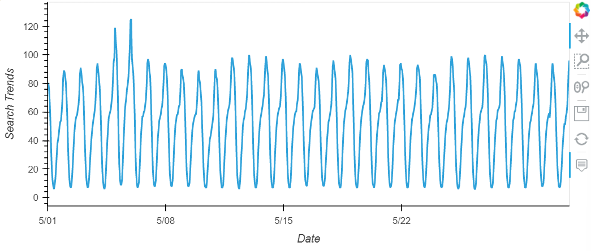
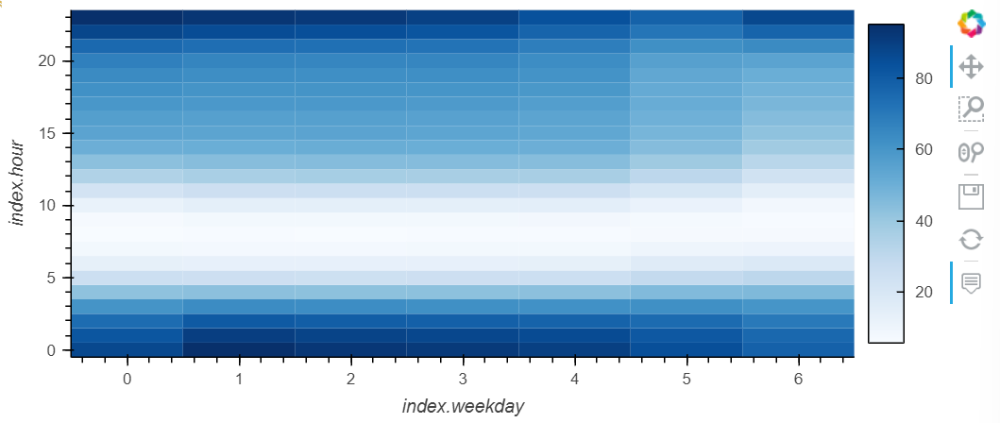
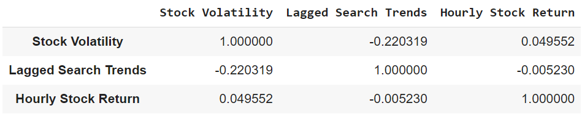
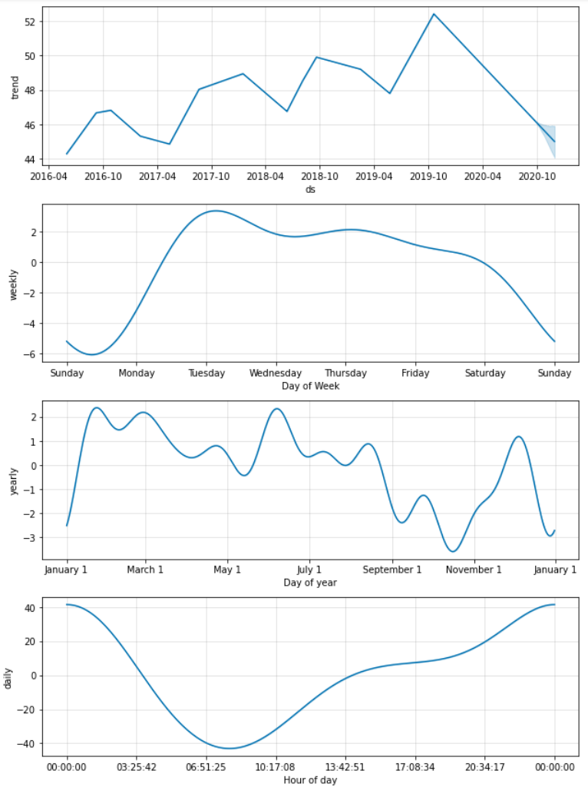
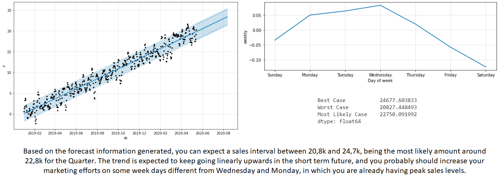

# e-Commerce Traffic Prediction

This project analyses growth scenarios for MercadoLibre, one of the most popular e-commerce sites in Latam.

The analysis is implemented in several steps: 

* Finding unusual patterns in hourly Google search traffic
* Mining the search traffic data for seasonality
* Relating the search traffic to stock price patterns, in order to see if the ability to predict search traffic can translate into the ability to successfully trade the stock
* Creatinf a time series model with Prophet
* Forecasting revenues by using time series models

---

## Technologies

The whole project is implemented in Python, writen in Jupyter lab using the Numpy and Pandas libraries for calculations, hvplot for plotting and Prophet for the time series modeling and forecasting: 

* ```import pandas as pd```
* ```import numpy as np```
* ```import hvplot.pandas```
* ```from prophet import Prophet```
* ```import datetime as dt```
* ```%matplotlib inline```


Prior to execution, we need to install de required related libraries. In this case, as we are using Google Colab, we run the following:

* ```!pip install pystan```
* ```!pip install prophet```
* ```!pip install hvplot```
* ```!pip install holoviews```


The .csv files are contained in the ```Resources``` folder.

---

## Usage

Run the main ```forecasting_net_prophet.ipynb``` in Google Colab. 

In the **first part**, we analyze any unusual patterns in the Google search data for the company, and connect them to the corporate financial events (ie. quarterly results presentation month data). Then we calculate the total search traffic for that month, and compare the value to the monthly median across all months.



**Secondly**, we group the hourly search data to plot the average traffic by the day of the week, using hvPlot visualize this traffic as a heatmap and analize weekly patterns during the year:



**Third**, we analyze the correlation between lagged search trends, hourly stock return and the stock volatility, to see if there is a predictable relationship between the three factors:



**Finally**, we a time series model that analyzes and forecasts patterns in the hourly search data:



And we also forecast Revenue by Using Time Series Models and give the Sales team some advice based on the revenues forecast results:



---

## Contributors

Feature developed by Lourdes Dominguez [(LinkedIn profile)](https://www.linkedin.com/in/lourdes-dominguez-bengoa-12333044/)

---

## License

Use only for academic purposes.